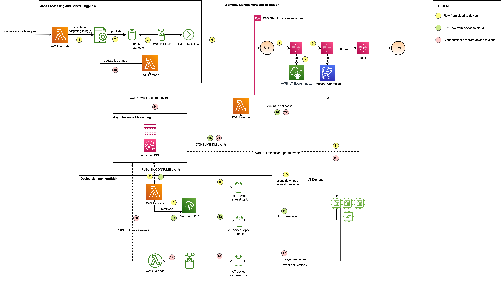

## IoT Workflow Management and Execution (WME) 
This code sample illustrates a possible implementation of workflow management and orchestration for IoT device workflows, using Serverless AWS services, such as AWS Step Functions, Amazon DynamoDB, AWS Lambda, as well as AWS IoT Core. 
One workflow is currently implemented, the firmware upgrade, but the solution can be extended to implement other workflows as needed.

This code sample is accompanying the research paper prepared for  the [embedded world Conference 2023]((https://events.weka-fachmedien.de/embedded-world-conference/program/)) entitled _"Cloud-Managed Finite State Machines for Remote Orchestration of IoT Device Workflows"_.

## High-Level Architecture


A sequence diagram is located in [here](/docs/high-level-solution.png). 

## Building and deploying the project

This project can be built with [AWS SAM](https://docs.aws.amazon.com/serverless-application-model/latest/developerguide/what-is-sam.html). 
Follow the following steps to build and deploy:
1. Ensure that you have exported the AWS credentials for your account and region.
2. In the project root directory, `iot-workflow-management-and-execution`, run:
   ```
   sam build
   sam deploy --guided
    ```
3. Once the AWS resources are created, upload the protobuf descriptor file to the S3 bucket (`usp1.1bucket`).

## Testing
1. To start testing the solution, make sure the IoT device simulator instances are running. Follow the instructions [here](device-agent-simulator/README.md) to run as many instances of the simulator as you want.
2. If you want to start state machine execution on multiple devices, you can create a dynamic thing group, based, for example, on the current firmware version, by running the command below:

`aws iot create-dynamic-thing-group --thing-group-name "devices_on_factory_firmware_version" --query-string "attributes.firmwareVersion: 1.2.1"`

3. Trigger the JobsCreateJob AWS Lambda function (either from the command Terminal or from the AWS Console), with the following payload:

```
{
  "firmwareVersion": "1.2.3",
  "upgradeTrigger": "manual",
  "targetArn": "arn:aws:iot:<YOUR_REGION>:<YOUR_ACCOUNT_ID>:thinggroup/devices_on_factory_firmware_version"
}

```
This will start the execution of one AWS Step Function state machine per running instance of the device simulator. 

## Security

See [CONTRIBUTING](CONTRIBUTING.md#security-issue-notifications) for more information.

## License

This library is licensed under the MIT-0 License. See the LICENSE file.

