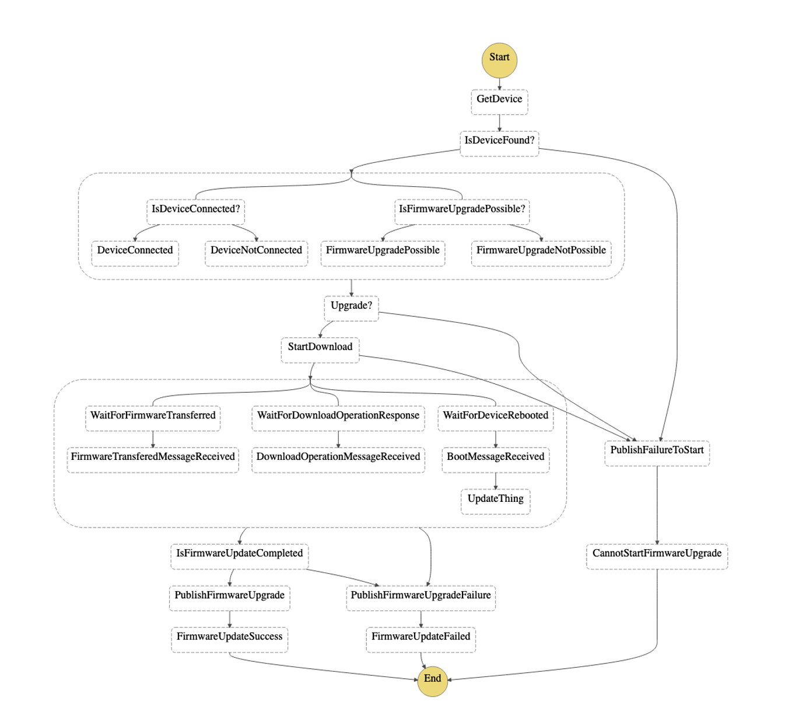
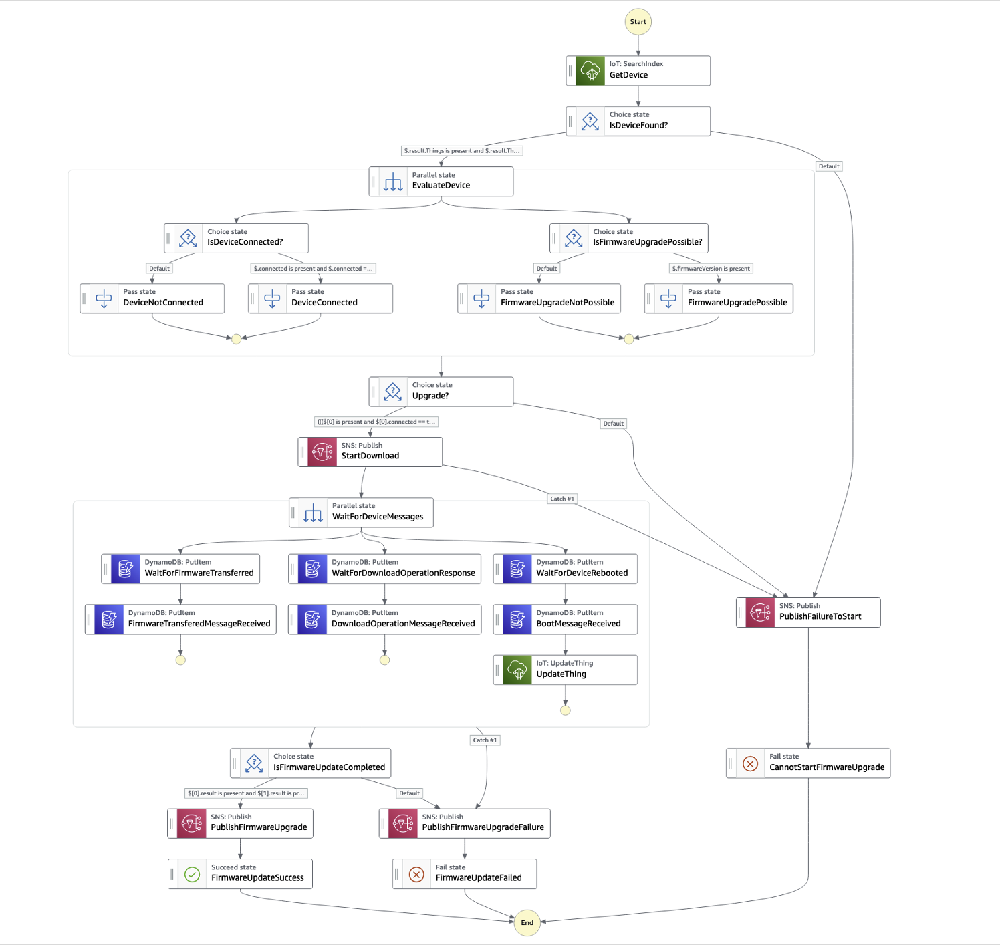

## IoT Workflow Management and Execution (WME) 
This sample project is accompanying the research paper prepared for  the [embedded world Conference 2023](https://events.weka-fachmedien.de/embedded-world-conference/program/) entitled _"Cloud-Managed Finite State Machines for Remote Orchestration of IoT Device Workflows"_. 

The example explores modelling workflows using Finite State Machines (FSM) to break down complexity and introduce an externalized, cloud managed approach to design, build, operate and remotely orchestrate resilient workflows
outside the scope of specific request/response cycles and independent of device uptime.

The code sample illustrates a possible implementation of workflow management and orchestration for IoT device workflows which is agnostic of specific low-level IoT device management protocols. 
In this example, we are using serverless AWS services, such as AWS Step Functions, Amazon DynamoDB, AWS Lambda, as well as AWS IoT Core, Rules Engine and AWS IoT Device Management Jobs. 

One example workflow is implemented, the firmware upgrade, but the solution can be extended to implement other workflows that involve primitive or non-primitive IoT device operations, as well as interactions with other systems.

## Design Considerations
The approach described in this project is to externalize workflow and workflow execution management, in a separate component. 

The different components interact with one another following Domain-Driven Design principles:

1)	**Bounded context:** The domains are clearly defined, have their own responsibilities and specify interfaces to other domains.
2)	**Loose Coupling:** The domains are loosely coupled; their implementations are not aware of each other at a detailed level and can be altered or replaced over time.
3)	**Message Driven:** The domains collaborate with each other via defined messages. Each domain has a specific set of messages that it sends or receives. 
4)  **Encapsulation:** Each domain encapsulates its own concerns, the resilience within that domain, error handling, and the data storage for that domain.

**Domain Components:**
1. **Job Processing and Scheduling**: Component that allows for creating and submitting jobs for execution, targeting a device or a group of devices.
2. **Workflow Management and Execution**: Component which models workflows as ordered sets of steps/tasks, coordinates executions, tracks state at each task and at workflow level.
3. **Device Management**: Component that exposes core functionality like device operations, storing/retrieving device data, or validation of device status. This component implements Device Management protocols specifics (like LWM2M, TR-369 etc) in its communication to the IoT Devices, but 
creates an abstraction layer on top of these protocols.

Note that this design can be implemented with other technologies, frameworks and services. This samples shows an example implementation.


## High-Level Architecture


A sequence diagram is located in [here](/docs/Sequence-Diagram.png). 

The sample state machine for the firmware upgrade workflow implemented by this sample project is located [here](workflow-management-and-execution/statemachine/firmware_upgrade.asl.json)





## Building and deploying the project

This project can be built with [AWS SAM](https://docs.aws.amazon.com/serverless-application-model/latest/developerguide/what-is-sam.html). 
Follow the following steps to build and deploy:
1. Ensure that you have exported the AWS credentials for your account and region.
2. In the project root directory, `iot-workflow-management-and-execution`, run:
   ```
   sam build
   sam deploy --guided
    ```
3. Once the AWS resources are created, upload the protobuf descriptor file to the S3 bucket (`usp1.1bucket`).

## Testing
1. To start testing the solution, make sure the IoT device simulator instances are running. Follow the instructions [here](device-agent-simulator/README.md) to run as many instances of the simulator as you want.
2. If you want to start state machine execution on multiple devices, you can create a dynamic thing group, based, for example, on the current firmware version, by running the command below:

`aws iot create-dynamic-thing-group --thing-group-name "devices_on_factory_firmware_version" --query-string "attributes.firmwareVersion: 1.2.1"`

3. Trigger the JobsCreateJob AWS Lambda function (either from the command Terminal or from the AWS Console), with the following payload:

```
{
  "firmwareVersion": "1.2.3",
  "upgradeTrigger": "manual",
  "targetArn": "arn:aws:iot:<YOUR_REGION>:<YOUR_ACCOUNT_ID>:thinggroup/devices_on_factory_firmware_version"
}

```
This will start the execution of one AWS Step Function state machine per running instance of the device simulator. 

## Security

See [CONTRIBUTING](CONTRIBUTING.md#security-issue-notifications) for more information.

## License

This library is licensed under the MIT-0 License. See the LICENSE file.

